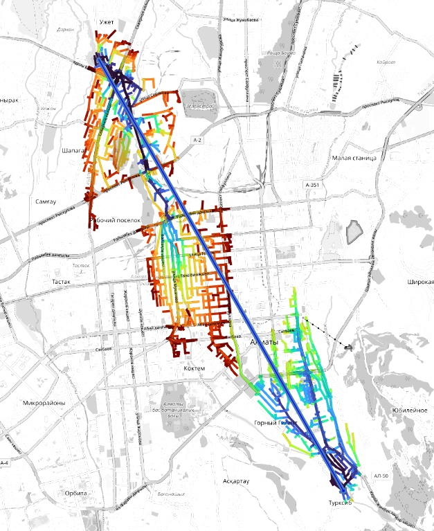

# Transitology

This is a demo of my skills in Rust for potential employers. This is a public transit router, work in progress.

Parts already built:

* `osmio2` -- reads OSM XML files and lets you iterate/map over objects
* `graph` -- OSM file to routing graph converter
* `route` -- router with A* and ALT algorithms implemented

## osmio2

This is a library that can read and write `.osm[.gz|.bz2]` files. It's similar to [osmio](https://crates.io/crates/osmio), but all shorthands don't crash, and it can handle .gz and .bz2 files seamlessly.

It gives you an iterator over all objects (with options to skip nodes/ways/relations) to save CPU cycles, and map_* shorthands.

Example: reading nodes and ways from an OSM file:

```rust
use osmio2::{reader::OsmXmlReader, objects::OsmObj};

fn main() -> Result<(), Box<dyn Error>> {
	let mut rd = OsmXmlReader::from_path("some-path.osm.gz")?;
	rd.skip_relations = true;

	for w in rd {
		match w? { // w is Result<OsmObj, ReadError>
			OsmObj::Way(way) => { println!("{:?}", way.nodes) },
			OsmObj::Node(node) => { println!("{:?}", node.id) },
			_ => {}
		}
	}
}
```

A simpler syntax to iterate over only one kind, ways:

```rust
let mut rd = OsmXmlReader::from_path("some-path.osm.gz")?;
rd.map_ways(|w| {
	println!("{:?}", way.nodes);
	Ok(())
})?;
```

It's parallelizeable with [rayon](https://docs.rs/rayon/0.6.0/rayon/).

## graph

Converts OSM XML files into raw graph. Vertice of the graph are either intersections, or joints of roads of different types. The latter should be then contracted to reduce the number of edges and vertice in routing. At this stage, it ignores [`oneway`](https://wiki.openstreetmap.org/wiki/Key:oneway) tag.

Example output:

```csv
node1,node2,WKT,category,lanes
252613842,910721898,"LINESTRING(83.09475 54.85918, ... 83.097115 54.8574)",secondary,1
209908088,892761717,"LINESTRING(83.088135 54.83076, ... 83.094734 54.833687)",secondary,1
...
```

Geometry column is called `WKT` to make this easy to see in [QGIS](https://qgis.org/).


## route

Implementation of "real" routing graph and algorithms on it. So far, these are just [A-Star](https://en.wikipedia.org/wiki/A*_search_algorithm), and [ALT](https://www.microsoft.com/en-us/research/wp-content/uploads/2004/07/tr-2004-24.pdf).


Currently, it calculates shortest paths between routes and measures speed of the algorithms. 

Usage:

```
$ cd graph
$ cargo run -r ../path-to-osm-file.osm.bz2 ../graph.csv
$ cd ../route
$ cargo run -r ../graph.csv ../route-result.csv
```

Results visualized in QGIS:

A* algorithm:



ALT algorithm:


Currently, routing is distance-based, and ALT doesn't have a big advantage over A*, just ~2x.
